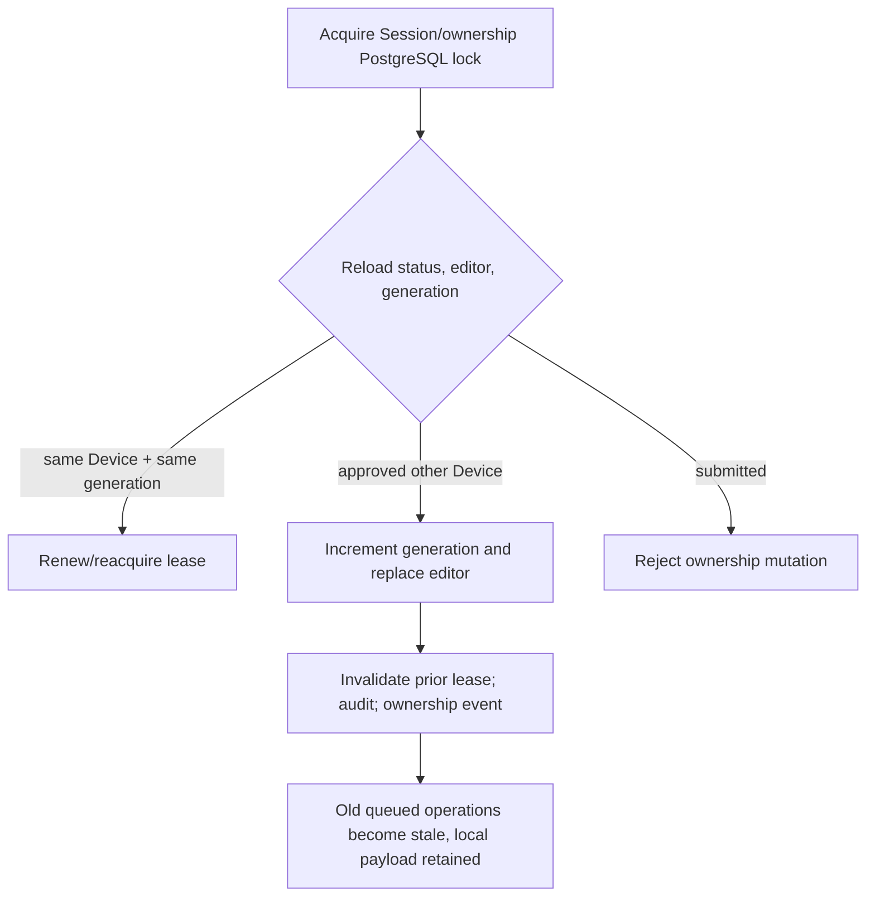

# ADR-0008: Commercial Receiving ownership and offline synchronization

- Status: Accepted; backend implemented by Task 7C1 and mobile contract frozen by Task 7C2A
- Date: 2026-08-01
- Scope: Commercial Receiving lifecycle, aggregate, ownership generation,
  cloud reference, immutable facts, and offline operation ordering

## Status

Accepted for Task 7C0 design. Implementation and any unresolved business
transition remain subject to the stated future gates.

## Context

Task 6 proved one-editor ordering and response-loss replay with a short POC
lease, temporary Device headers, POC strings, a POC reference, and POC
Approved/Finalized states. Those mechanisms are useful evidence but are not
production authority. Commercial identity and masters now exist, while the
production ownership epoch, expired-lease recovery, reference allocation, and
submitted boundary must be frozen without implementing settlement or posting.

Offline capture creates a tension: a renewable online lease may expire while
the durable editor still owns immutable physical facts. Treating lease expiry
as permanent loss would violate the product rule that offline physical facts
are not silently discarded. Letting another Device acquire automatically would
violate the one-editor rule.

## Decision

### Lifecycle

Production Commercial Receiving persists only `ReceivingInProgress` and
`SubmittedForSettlementReview`. Submission is the Task 7C terminal boundary,
clears edit capability, and makes Session/Entry snapshots immutable.
Cancellation and post-submission correction remain open. Lease/recovery health
is not encoded as a business lifecycle status. POC Approved and Finalized
states are not promoted.

### New aggregate

Create new production concepts:

- `CommercialReceivingSession` as the aggregate root;
- immutable `CommercialReceivingEntry` children;
- one-to-one `CommercialReceivingOwnership` for current editor, generation,
  lease, and ownership revision.

Do not rename or reuse POC entities/tables. The mobile-generated Session UUIDv7
is the cloud aggregate ID. Entry and operation UUIDv7 identities are preserved
from local capture. Workspace, Company, and authenticated default Branch are
cloud-owned authority fields.

Session and Entry safe master identities, versions, codes, names, classes,
policy, and optional standard-weight facts are captured as immutable snapshots.
The Session additionally captures Company Procurement Settings ID/version and
the authoritative vehicle-selection mode from that exact revision. History
never depends on a mutable join. Raw weight remains unchanged; processed/
display values are server-recomputed under the captured Task 3 policy and must
match exactly.

### Ownership layers

Ownership has three independent meanings:

1. **Durable editor:** the authenticated Device allowed to create operations.
2. **Generation:** a positive epoch starting at 1 and incrementing whenever an
   explicit different-device transfer/recovery succeeds.
3. **Lease:** a renewable, server-clock online capability for the current
   editor/generation.

Start assigns editor and generation 1. A same-device reacquisition after expiry
may issue a new lease without incrementing generation. A different Device
cannot acquire automatically. Its approved transfer/recovery transaction
changes editor, increments generation, invalidates the old lease, and commits
audit/event evidence. Task 7C1 implements Owner-only transfer; Task 7C2A
defers the mobile transfer UI.

All three ordered mobile operation types claim one database idempotency scope,
`Procurement.CommercialReceiving.MobileSyncOperation`. The server canonical
hash binds that exact scope, actual operation type, immutable Session, sequence,
operation-appropriate generation, payload/payload hash, and authenticated
context/Device. Reusing an operation UUID under another type is therefore
`IDEMPOTENCY_PAYLOAD_CONFLICT`, with no execution.

Start carries no generation, cloud version, or lease. Record and Submit require
generation and a current lease ID as transport metadata, but carry no expected
cloud version. Mutable aggregate/cloud versions and renewable lease metadata
are excluded from immutable payload and hash. Therefore the unchanged editor
can retry the same operation after cloud progress or same-device reacquisition
without changing operation identity or physical payload. An old-generation
operation is stale and rejected; its local fact remains available for explicit
reconciliation. Separate authenticated transfer/recovery controls may use
expected Session/ownership versions after their approval policy is resolved.

### Ordering and transactions

Start consumes local sequence 1; each Entry and Submit must match the exact
next sequence. Device timestamps never establish order. Each operation commits
its aggregate/Entry revision, audit, `CommercialMobileSync` outbox fact, and
idempotent result in one PostgreSQL transaction. A batch processes in request
order with one transaction per operation; a failure blocks later work for that
Session while unrelated Sessions continue.

Ordered operation concurrency relies on the authenticated Device, ownership
generation, exact local sequence, current Session status, and PostgreSQL
aggregate/ownership row/advisory locks. Those locks also serialize ownership
acquisition/renewal/transfer and submission across API instances. One lock order
is used so races have one database serialization point. No mutable client cloud
version or process-local lock is a correctness boundary.

### Cloud reference

A new company-scoped database allocator assigns one positive numeric reference
value during Start. A renderer stores one immutable reference and format
version. It is separate from aggregate identity, POC references, Purchase Bill
numbering, and final-posting numbering. The implemented default is
`RCV-{SEQ:000000}` with `Never` reset and starting number 1.

## Race outcomes

- Same-device reacquisition versus transfer: the lock winner determines the
  observed generation; no prior-generation lease survives a transfer.
- Queued Entry versus transfer: Entry commits only if its generation validates
  before the transfer serialization point.
- Concurrent recoveries: one expected generation/version wins; exact replay is
  idempotent.
- Submission versus recovery: submission closes ownership if it wins;
  recovery makes the old Submit generation stale if it wins.

## Scope

This decision covers Start, immutable Entry acceptance, ownership, read-only
monitoring data, and Submit. It also fixes stable ownership/sequence failure
categories and response-loss behavior.

## Non-goals

No cancellation, correction, transfer approval policy, settlement, bag
deduction, Purchase Bill, payable, Inventory movement, Sales, Finance posting,
or official purchase finalization is decided. No production endpoint, table,
migration, Flutter screen, or package is implemented by Task 7C0.

## Authoritative sources

- `AGENTS.md`
- TPRC-101 baseline/open questions
- ADR-0001 through ADR-0007
- TPTECH-001.13 through TPTECH-001.21
- Task 7C0 binding direction

## Data ownership

Cloud-confirmed aggregate/ownership state is authoritative. The editor mobile
database owns immutable local capture and operation evidence until acceptance
and retains it for reconciliation. Masters own current records; Receiving owns
only snapshots. Owner-monitoring caches are read-only projections.

## Transaction boundaries

Start, Entry, Submit, and ownership change each have an explicit atomic
PostgreSQL boundary including idempotency, audit, and outbox. Local Entry save
includes Entry, operation, and exact Session projection in one encrypted SQLite
transaction. Event application includes inbox, projection, and cursor in one
transaction.

## Failure behavior

Stable ownership errors include
`RECEIVING_OWNERSHIP_DEVICE_MISMATCH`,
`RECEIVING_OWNERSHIP_GENERATION_STALE`, `RECEIVING_LEASE_REQUIRED`,
`RECEIVING_LEASE_INVALID`, and `RECEIVING_LEASE_REACQUISITION_REQUIRED`.
Reversible lease/stale-master
conditions, Device mismatch, and stale generation create attention without
consuming or rewriting the physical operation. A blocked follower uses
`RECEIVING_OPERATION_WAITING_FOR_PRIOR_SEQUENCE` without creating a claim.
Database failure rolls back the complete unit. Ambiguous response reuses the
same operation.

## Security implications

Authenticated context, not request bodies or POC headers, supplies Device and
tenant authority. Generation limits a stolen/old Device after transfer. Lease
IDs are capabilities, are not events or physical payload, and require HTTPS
and encrypted local storage. PostgreSQL RLS remains mandatory before
production.

## Migration implications

Task 7C1 creates new production aggregate, Entry, ownership, allocator, indexes,
constraints, immutability/state-shape triggers, and event audience changes.
Existing POC tables, references, and rows remain untouched. Task 7C2 creates a
separate encrypted production local schema; no POC table is repurposed.

## Future implementation dependencies

- Task 7C1 backend plan and approved database/endpoint review
- Task 7C2 secure storage and local schema plan
- TPCL-101/TPFS-101 resolution for transfer approval, cancellation,
  correction, limits, and zero-weight/submission rules

## Unresolved questions

Stale-master recovery, old-generation fact reconciliation, cancellation,
correction, business limits, optional fields, and later lease anomaly policy
remain open. The default reference, 60-minute lease, 10-minute heartbeat,
Owner-only backend transfer, and absence of transfer UI are closed.

## Task 7C2A offline capture clarification

A securely bound authenticated Operator may create the local UUIDv7 Session
and immutable Entries offline from valid cached Active master/settings
revisions. Start remains sequence 1 and dependent operations stay queued until
Start returns the cloud reference, generation, and lease. Start rejection
preserves the facts in attention; no official number is generated locally and
no Entry/payload is rewritten. Task 7C2 capture source is exactly `Manual`.

## Consequences

- Lease expiry no longer destroys durable ownership or offline evidence.
- A transfer has an unambiguous epoch boundary across replicas and restarts.
- Submitted state is small, immutable, and does not imply settlement approval.
- The production implementation cannot reuse the shorter POC path unchanged.
- Recovery UI/commands cannot ship before their business authority is approved.

## Alternatives rejected

- Promoting the POC five-minute lease was rejected because expiry would
  permanently strand valid offline facts and the policy lacks production
  review.
- Lease-only ownership was rejected because lease expiry is not consent to
  transfer.
- Automatic different-device takeover was rejected because it creates two
  possible editors and unaudited authority changes.
- Putting refreshed lease metadata in immutable payload/hash was rejected
  because reacquisition would cause idempotency conflicts.
- Putting a mutable expected cloud version in ordered offline operations was
  rejected because cloud progress would change immutable replay identity; the
  aggregate lock, status, generation, and sequence provide concurrency control.
- Adding generic Approved/Finalized states was rejected because they exceed the
  submission boundary.
- Renaming POC tables/classes was rejected because their tenancy, identity,
  masters, lifecycle, and security contracts are non-production.
