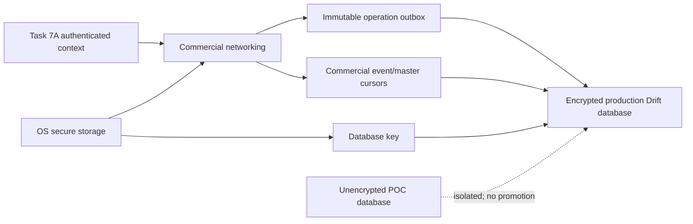

# ADR-0009: Authenticated commercial mobile sync and storage

- Status: Accepted for Task 7C0 design; storage selection completed by ADR-0011
- Date: 2026-08-01
- Scope: Commercial operation/event/master sync, mobile Task 7A integration,
  encrypted storage, and production local-schema isolation

## Status

Accepted for Task 7C0 design. ADR-0011 now selects SQLite3MultipleCiphers 2.3.6
through `sqlite3` 3.5.0 with SQLite 3.53.3, explicit ChaCha20-Poly1305, and a
true random 256-bit raw key for TraderPro V1. `flutter_secure_storage` 10.3.1
is the frozen B2 secure-store input; neither package has been added to
production Flutter.
Task 7C2A produced passing host and physical Android 15/API-35 evidence for
SQLite3MultipleCiphers, SQLCipher, OS secure storage, and force-stop/process-
restart recovery. Task 7C2B1 froze raw-key/cipher parameters and added passing
host tamper/interruption, API-24/API-35 engine, repeated physical performance,
native provenance, candidate notice, locked SBOM, and reviewed SCA evidence.
It corrected the pinned secure-store clean-install bootstrap and passed the
fail-closed, force-stop, and same-data replacement matrix on API 24 and
physical API 35 with both candidates. The final static comparison accepted
SQLite3MultipleCiphers in ADR-0011, making Task 7C2B1 complete subject to
commit review. Task 7C2B2 is next and has not started; other B2/review/pilot
gates remain open. Automatic/in-place rekey is explicitly outside V1.

## Context

Task 6B proves local-first capture, immutable operations, response-loss replay,
event inbox/cursor atomicity, read-only owner projections, and foreground
coordination. It also uses temporary IDs, debug HTTP, a POC event stream, POC
profiles, and ordinary unencrypted SQLite. Task 7A supplies production backend
identity but Flutter activation, token rotation coordination, and secure
storage do not yet exist. `Internal` events contain implementation-oriented
commercial master facts and cannot be exposed directly to mobile.

Production commercial synchronization therefore needs a separate authenticated
contract and a storage boundary that fails closed without encryption.

## Decision

### Authenticated routes and authority

Reserve these Task 7C1 routes:

```text
POST /api/v1/mobile/commercial-sync/operations
GET  /api/v1/mobile/commercial-sync/events
GET  /api/v1/mobile/commercial-sync/masters
```

Every request requires a Task 7A bearer access token and database-revalidated
`IAuthenticatedTraderProContext`. Workspace, Company, default Branch, User,
Device, and role are not body authority. Temporary POC workspace/device headers
are ignored. Commercial and POC routes, middleware, profiles, cursors, hashes,
and local records remain independent.

The operation endpoint accepts at most 50 ordered Start/Record/Submit
operations. All types share the database command scope
`Procurement.CommercialReceiving.MobileSyncOperation`; operation UUID is the
idempotency key and actual operation type is hashed, so reuse across types is a
payload conflict. Start omits generation/lease; Record and Submit require both.
All omit mutable expected cloud version. Immutable payload bytes and SHA-256
survive restart and response loss. Authenticated Device is part of the server
canonical hash; renewable lease metadata, cloud version, and token identity are
not.

### Event audience

Add controlled outbox stream `CommercialMobileSync`, distinct from `Internal`
and temporary POC `MobileSync`. Commercial events distinguish safe Owner company
broadcasts from immutable rows targeted to a Device. An authenticated Owner
may read `OwnerBroadcast`. An authenticated active Device may read
`TargetDevice` rows issued to it, including transfer-away history. Current
editor/generation is revalidated for mutations and determines future targets;
it does not suppress historical delivery. An Operator has no broader list/live
entitlement, and company membership alone grants no access to unrelated
Session events. Broader non-editor Operator discovery/monitoring requires a
product decision.

Cursor reads use an ordered database sequence, do not mutate delivery state,
and return exact committed payloads. The commit-order lock is scoped by stream
contract version + Workspace + Company, so companies write concurrently and
cursor gaps from other companies are valid. PII/secrets are excluded by an
event allowlist.

### Master synchronization

Add a dedicated authenticated, versioned, company-scoped master-sync projection
and cursor. It covers Suppliers/scopes, Products/groups, Bag Types/standards,
Locations, Vehicles, Weight Policies, and Procurement Settings, including
Inactive records for history. Task 7C1 creates a migration-backed
`commercial_mobile_master_changes` log: the migration deterministically
backfills one safe current row for every existing Task 7B1/7B2 master,
association, and settings record before endpoint enablement, and later master
mutations append versioned changes atomically.

Initial sync omits `cursor`; the server captures a scoped committed high-water
mark `H`, embeds traversal state in an opaque returned cursor, pages unique
changes through `H`, then resumes strictly after `H`. The same scoped master-
stream lock orders mutation sequence allocation and high-water capture, so a
concurrent change appears either in bootstrap or later delta, never neither.
The client applies a master version and cursor atomically. Raw `Internal` outbox
records are never returned or copied as mobile payloads.

### Mobile Task 7A integration

Activation stores the one-time returned Device secret using OS-backed secure
storage. Login binds the local profile to `/auth/me` Workspace/Company/default
Branch/User/Device/role. Access tokens are short-lived; refresh tokens rotate.
Exactly one refresh coordinator exists per commercial runtime, and concurrent
API calls await its one in-flight refresh. An ambiguous refresh retries the same
predecessor within Task 7A's safe replay window. Token failure never regenerates
Receiving operation IDs.

Logout, logout-all, revocation, and reactivation clear/re-establish credentials
without rewriting the encrypted operational database. Pending work resumes
only under the exact same Workspace/Company/Device binding. Silent profile
identity change is prohibited while unresolved commercial work exists.

### Encrypted storage

Use a separate production encrypted SQLite file before pilot. Store Device
secret, refresh token, and database key/key reference only in OS-backed secure
storage, outside SQLite. No plaintext fallback is allowed. The chosen encrypted
SQLite engine must integrate through the Drift executor and pass an Android
compatibility/security spike; no package is selected by Task 7C0.

SQLCipher-compatible/page-encrypted options are preferred for evaluation.
Application-only field encryption and OS file permissions are insufficient as
the sole database protection. POC SQLite is neither upgraded in place nor
treated as encryption migration evidence.

Production local tables/records are prefixed/isolated for commercial account
profile/credential metadata, master cache, Sessions, immutable Entries,
immutable operation outbox, cloud state, event inbox, cursor, Owner projection,
and attention. Event apply and cursor advance are atomic. No local financial or
Inventory state is introduced.

The local event cursor identity adds source/stream, contract version,
Workspace, Company, and Device around the opaque server cursor. The server
cursor is never decoded or reconstructed by mobile.

An authenticated securely bound Operator may create a local Session and
immutable Entries offline from valid cached Active master/settings revisions.
Start remains sequence 1 and dependent operations stay queued until Start is
accepted and returns the official reference, generation, and lease. Rejection
preserves every physical fact in attention without payload rewrite. Task 7C2
capture sends only `weightSource: "Manual"`.



## Scope

This decision covers authentication orchestration, operation/event/master
transport boundaries, credential/key placement, production local-schema
concepts, reinstall/backup/key-loss behavior, and POC isolation.

## Non-goals

No Flutter implementation, package addition, Drift migration, backend endpoint,
database migration, background service, SignalR requirement, remote wipe,
hardware attestation, MFA, mobile integrity API, settlement, Inventory, or
Finance behavior is included in Task 7C0.

## Authoritative sources

- `AGENTS.md`
- ADR-0001 through ADR-0008
- TPTECH-001.14, TPTECH-001.17, TPTECH-001.18, TPTECH-001.21
- TPRC-101 baseline/open questions
- Task 7C0 binding direction

## Data ownership

The Task 7A backend owns current identity/session authority. Secure storage owns
small secrets/key material. The encrypted database owns durable local
operational evidence and disposable projections. The cloud owns accepted shared
state. Master modules own current records; the mobile cache owns only copies.

## Transaction boundaries

- Credential replacement is durably written before waiting requests resume.
- Local Entry and operation commit together before reporting saved.
- Operation response and cloud-state/delivery transition commit together.
- Event inbox, projection, apply status, and cursor commit together.
- Master page/change application and its cursor commit together.
- Secret/key changes use a crash-safe staged switch; no plaintext intermediate
  is accepted.

## Failure behavior

Ambiguous operation/refresh responses reuse the same durable identity/token
within their respective replay contracts. Revoked families force re-login.
Cross-context profile, cursor, or database use fails closed. Missing/wrong
database key retains ciphertext and requires explicit recovery/discard; no
plaintext database is created. Malformed known events prevent cursor advance;
unknown compatible events are retained and safely skipped by versioned policy.

## Security implications

The design mitigates copied-database disclosure, token replay, cross-company
cursor reuse, operation tampering, and POC-context confusion. Rooted Devices
may still extract runtime memory or intercept input; encrypted storage reduces
at-rest exposure but is not hardware attestation. Release builds require HTTPS
and must not inherit debug cleartext configuration.

## Migration implications

Task 7C1 adds the commercial event stream/audience metadata and scoped commit-
order lock, deterministic master-change table/backfill/high-water protocol, and
endpoints without reclassifying existing events.
Task 7C2B2 may add a new encrypted database schema version 1 using the single
engine accepted by ADR-0011. Existing POC tables and unencrypted files remain
untouched; no automatic data import occurs. V1 does not implement automatic or
in-place rekey, engine switching, cloud key escrow, or cross-device database
restore. Key loss fails closed and retains ciphertext; destructive recovery is
a separate authorized workflow. Any future schema, key, cipher, or engine
change requires a separately approved, fault-injected migration design.

## Future implementation dependencies

- Accepted ADR-0011 and reviewed encrypted SQLite/OS secure-storage evidence
- Task 7A endpoint contracts and persistent Data Protection key ring
- Task 7C1 operation/event/master contracts
- Android release/backup policy and two-device commercial field test
- TPSEC-001 threat-model controls

## Unresolved questions

SQLite3MultipleCiphers 2.3.6 through `sqlite3` 3.5.0 is selected by ADR-0011.
The secret-store B2 input is `flutter_secure_storage` 10.3.1 with explicitly
frozen Android algorithms and migration/reset options, but neither is yet a
production dependency. The production secure-store namespace/alias,
key-rotation operations, backup policy details for supported Android versions,
production background execution, and hardware/mobile integrity controls
remain deferred. Business open questions remain in TPRC-101.

Owner monitoring is read-only. Owner transfer UI, voice selection, BLE/scale,
settlement, Purchase Bill, Inventory, Finance, Sales, Production,
cancellation, correction, reopen, and SignalR are not authorized by this
decision.

## Consequences

- Production mobile work cannot start pilot use on the current plaintext POC
  database.
- Token refresh and operation replay have separate stable identities and cannot
  accidentally regenerate one another.
- `Internal` and POC events remain inaccessible to commercial mobile cursors.
- A dedicated master-sync surface becomes Task 7C1 scope.
- Package addition is blocked until compatibility and security evidence exists.

## Alternatives rejected

- Reusing temporary headers was rejected because callers control them.
- Reusing POC `MobileSync` was rejected because it is unauthenticated and has a
  frozen POC audience/contract.
- Exposing `Internal` events was rejected because they are not a safe mobile
  API and may contain implementation projections.
- A static global access token was rejected because rotation, revocation, and
  concurrent refresh must be coordinated.
- Plain SQLite, OS permissions alone, and silent plaintext fallback were
  rejected because copied customer data would be readable.
- In-place promotion of POC tables was rejected because their identity,
  security, and lifecycle contracts are non-production.
