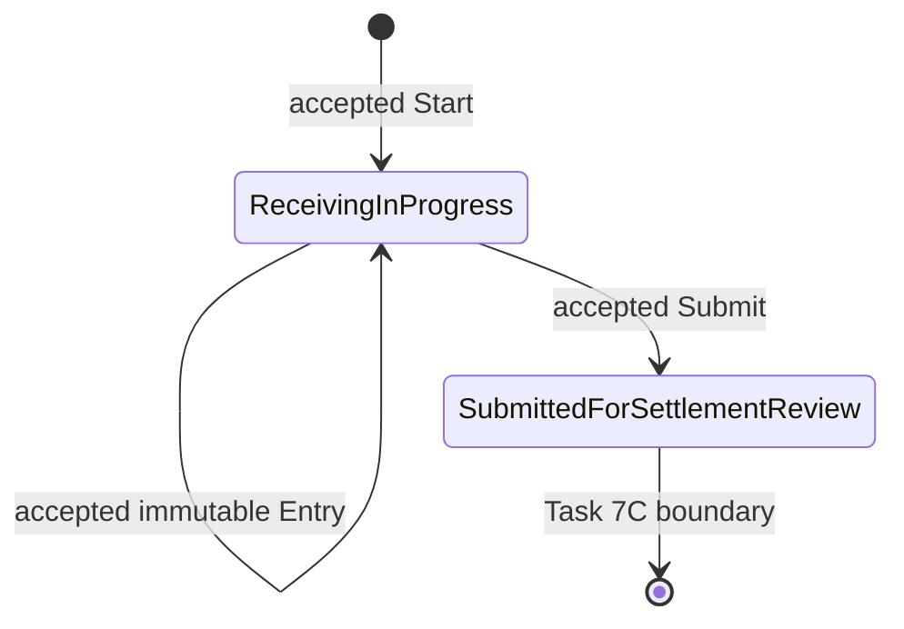
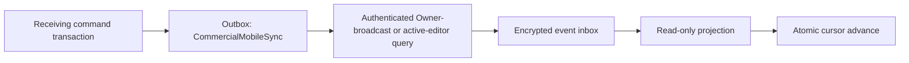
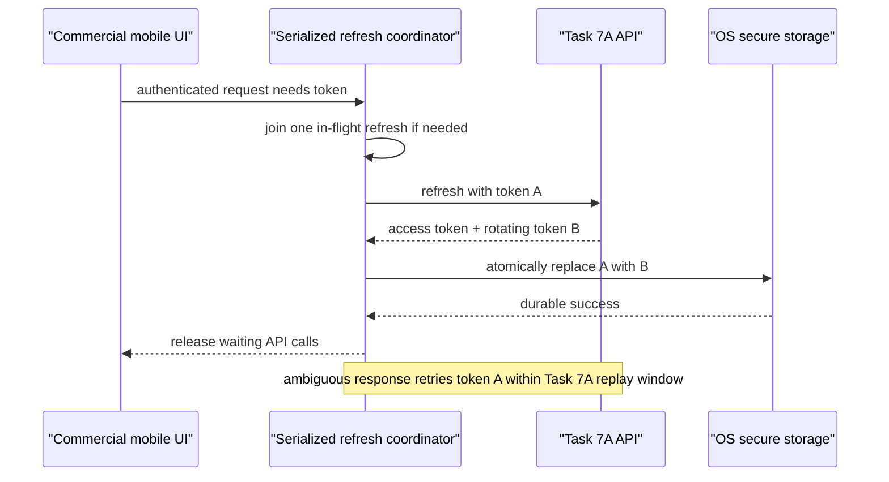
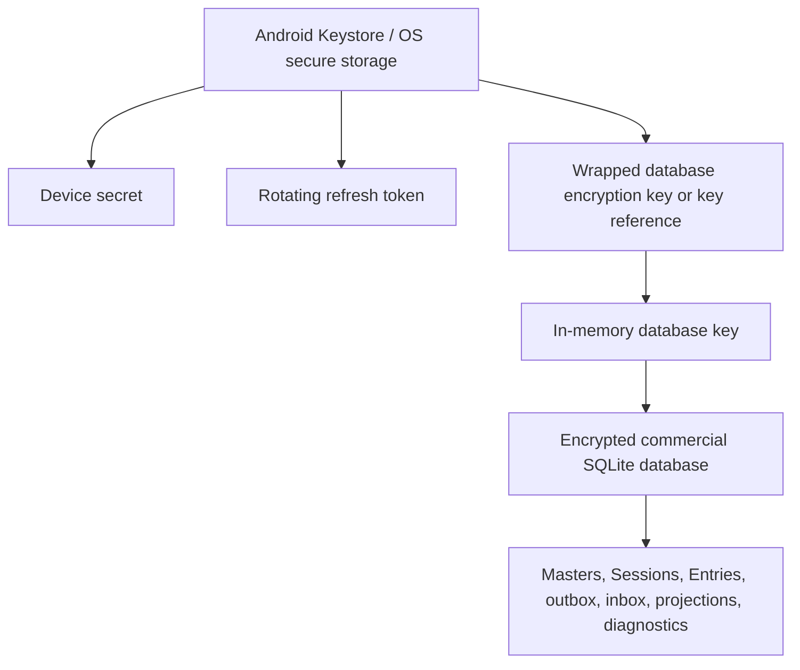

# TPTECH-001.21: Commercial Receiving Contract and Mobile Security Design

- Status: Accepted design for Task 7C0; implementation deferred to Tasks 7C1 and 7C2
- Date: 2026-08-01
- Scope: Production Commercial Receiving through submission for settlement review

## Status

Accepted as the Task 7C0 design contract. No production implementation is
claimed; Tasks 7C1 and 7C2 must satisfy the specified gates and tests.

## Objective

This specification freezes the production aggregate, ownership, numbering,
master-validation, authenticated synchronization, event, mobile-authentication,
secure-storage, local-schema, master-cache, and read-only monitoring boundaries
needed by Tasks 7C1 and 7C2. Task 7C0 changes documentation only.

## Scope

- Start a commercial Receiving Session from a mobile-generated UUIDv7.
- Capture immutable, exact Receiving Entries locally before synchronization.
- Permit one durable editor Device with a renewable online lease.
- Provide read-only Owner monitoring from authoritative cloud facts.
- Submit the Session for settlement review and close editing.
- Authenticate all commercial traffic using Task 7A.
- Encrypt the production mobile operational database before pilot use.

## Non-goals

This design does not implement or define Purchase Settlement, bag
reconciliation, empty-bag or DoublePlastic deductions, Goods Supplied to
Supplier accounting, Purchase Bills, supplier payables, Inventory movements,
Sales, Finance postings, official purchase finalization, cancellation,
post-submission correction, or a final display-reference format. It does not
promote Task 5/6 POC routes, headers, entities, tables, event stream, reference,
or SQLite database.

## Authoritative sources

- `AGENTS.md` and `README.md`
- TPRC-101 requirements baseline and open-question register
- ADR-0001 through ADR-0007
- TPTECH-001.12 through TPTECH-001.20
- TPRUN-001 and the physical-field hardening in commit `7cc3d29`
- The binding Task 7C0 direction dated 2026-08-01

The complete TPCL-101 and TPFS-101 sources are absent. Open behavior is not
invented here.

## Production lifecycle

The production aggregate persists exactly two Task 7C states:



`CancelledBeforeSubmission` is not included because cancellation authority and
Entry treatment are unresolved. `RejectedForCorrection` is not included
because submitted snapshots are immutable and the correction model is
unresolved. `OwnershipRecoveryRequired` is a derived attention/lease-health
condition, not a business lifecycle state. No `Approved` or `Finalized` state
is copied from the POC.

Valid transitions:

| From | Command | To | Required effect |
| --- | --- | --- | --- |
| Absent | `StartCommercialReceivingSession` | `ReceivingInProgress` | Allocate cloud reference, durable editor generation 1, and lease. |
| `ReceivingInProgress` | `RecordCommercialReceivingEntry` | same | Insert immutable Entry and advance sequence/count/total/version. |
| `ReceivingInProgress` | `SubmitCommercialReceivingSession` | `SubmittedForSettlementReview` | Set submission time and remove active lease/editor capability. |

Invalid transitions include Entry or Submit before Start; sequence reuse/gap;
Entry after submission; repeat Submit under a new operation ID; any mutation of
a submitted Session/Entry snapshot; and any Approved/Finalized transition.
Exact retry of an already accepted operation returns the stored result as
`PreviouslyProcessed` and is not a new transition.

Whether a zero-entry Session may submit and whether zero weight is a valid
Entry are open questions. Production enablement of those validations is gated
on source resolution.

## Data ownership

`CommercialReceivingSession` is the aggregate root.
`CommercialReceivingEntry` is an immutable child fact.
`CommercialReceivingOwnership` is a one-to-one concurrency component within
the aggregate boundary. The current ownership facts are stored once in that
component and exposed as part of the Session contract; they are not duplicated
across mutable tables.

The cloud owns shared status, cloud reference, accepted sequence, aggregate
version, current ownership generation/lease, and accepted snapshots. The
mobile database owns the durable local capture and immutable operation evidence
until cloud acceptance and retains it afterward for diagnostics/history.
Commercial master modules retain ownership of current master records;
Receiving owns only captured safe snapshots.

### `CommercialReceivingSession`

| Field | Type/shape | Contract |
| --- | --- | --- |
| `Id` | UUIDv7 | Generated once on mobile; aggregate primary identity. |
| `WorkspaceId` | UUID | From authenticated context; immutable. |
| `CompanyId` | UUID | From authenticated context; immutable. |
| `BranchId` | UUID | Authenticated default Branch; immutable. |
| `CloudReferenceNumber` | positive `bigint` | Database-allocated company series value; immutable. |
| `CloudReference` | bounded text | Renderer output captured once; opaque format pending source. |
| `CloudReferenceFormatVersion` | positive integer | Identifies renderer configuration used; immutable. |
| `Status` | controlled enum | `ReceivingInProgress` or `SubmittedForSettlementReview`. |
| `Version` | positive `bigint` | Starts at 1; advances once per Start/Entry/Submit material revision. |
| `CompanyProcurementSettingsId` | UUID | Exact same-company settings record captured at Start; immutable. |
| `ProcurementSettingsVersionSnapshot` | positive `bigint` | Exact validated settings revision captured at Start. |
| `VehicleSelectionModeSnapshot` | controlled text | Authoritative `Disabled` or `Optional` value from the captured settings revision. |
| `SupplierId` | UUID | Same company; immutable after Start. |
| `SupplierVersionSnapshot` | positive `bigint` | Exact validated master revision. |
| `SupplierCodeSnapshot` | text | Safe immutable snapshot. |
| `SupplierNameSnapshot` | text | Safe immutable snapshot; no contact/PII. |
| `SupplierProductScopeModeSnapshot` | controlled text | `Unrestricted` or `Restricted`. |
| `DestinationLocationId` | UUID | Active same-company/default-branch location. |
| `DestinationLocationVersionSnapshot` | positive `bigint` | Exact validated revision. |
| `DestinationLocationCodeSnapshot` | text | Immutable. |
| `DestinationLocationNameSnapshot` | text | Immutable. |
| `WeightProcessingPolicyId` | UUID | Active same-company policy. |
| `WeightProcessingPolicyVersionSnapshot` | positive `bigint` | Exact validated revision. |
| `WeightDecimalPlacesSnapshot` | 1, 2, or 3 | Task 3 capture policy. |
| `WeightProcessingMethodSnapshot` | `Standard`, `Floor`, `Ceiling` | Task 3 exact method. |
| `ReceivingVehicleId` | nullable UUID | Null when omitted/disabled. |
| `ReceivingVehicleVersionSnapshot` | nullable positive `bigint` | Required when a vehicle is selected. |
| `VehicleCodeSnapshot` | nullable text | Immutable safe value. |
| `VehicleRegistrationSnapshot` | nullable text | Immutable safe operational value. |
| `VehicleDisplayNameSnapshot` | nullable text | Immutable safe value. |
| `NextExpectedLocalSequence` | positive `bigint` | Start consumes 1; next is 2. |
| `EntryCount` | non-negative integer | Exact projection of accepted Entries. |
| `ProcessedTotalWeightKg` | `numeric(20,6)` | Exact sum; never floating point. |
| `StartedAtUtc` | UTC server timestamp | Accepted Start time. |
| `SubmittedAtUtc` | nullable UTC server timestamp | Required only in submitted state. |
| `CreatedAtUtc` | UTC server timestamp | Equals accepted Start time. |
| `UpdatedAtUtc` | UTC server timestamp | Last aggregate material revision. |

Session APIs also expose the current ownership component fields described
below. Heartbeat-only renewal advances ownership revision, not the Receiving
business Version, and does not change `UpdatedAtUtc`.

### `CommercialReceivingEntry`

| Field | Type/shape | Contract |
| --- | --- | --- |
| `Id` | UUIDv7 | Generated on mobile with the physical fact; immutable. |
| `WorkspaceId` | UUID | Authenticated context; immutable. |
| `CompanyId` | UUID | Authenticated context; immutable. |
| `ReceivingSessionId` | UUIDv7 | Same-company parent. |
| `OperationId` | UUIDv7 | Globally claimed in the shared mobile idempotency command scope; immutable. |
| `LocalSequence` | positive `bigint` | Unique with Session; exact next sequence. |
| `ProductId` | UUID | Selected master identity. |
| `ProductVersionSnapshot` | positive `bigint` | Exact validated revision. |
| `ProductCodeSnapshot` | text | Immutable safe snapshot. |
| `ProductNameSnapshot` | text | Immutable safe snapshot. |
| `ProductTypeSnapshot` | controlled text | Captured catalog type. |
| `ProcessingFamilyCodeSnapshot` | nullable text | Captured normalized family. |
| `SupplierScopeValidationSnapshot` | typed JSON/value object | Safe evidence described below. |
| `BagTypeId` | UUID | Selected master identity. |
| `BagTypeVersionSnapshot` | positive `bigint` | Exact validated revision. |
| `BagTypeCodeSnapshot` | text | Immutable. |
| `BagTypeNameSnapshot` | text | Immutable. |
| `BagConstructionClassSnapshot` | controlled text | Jute/SinglePlastic/DoublePlastic/Other. |
| `BagTareWeightKgSnapshot` | `numeric(20,6)` | Exact tare; not net content. |
| `BagReturnableSnapshot` | boolean | Captured Bag Type fact. |
| `ProductStandardBagWeightId` | nullable UUID | Optional selected standard. |
| `ProductStandardBagWeightVersionSnapshot` | nullable positive `bigint` | Required when selected. |
| `StandardBagWeightLabelSnapshot` | nullable text | Immutable. |
| `StandardContentWeightKgSnapshot` | nullable `numeric(20,6)` | Exact net content; separate from tare. |
| `BagCount` | positive integer | Business maximum unresolved. |
| `RawWeightKg` | text | Original accepted raw decimal string, byte-for-byte unchanged. |
| `ProcessedWeightKg` | `numeric(20,6)` | Server-reprocessed exact result. |
| `DisplayWeightKg` | text | Deterministic Task 3 display string at captured precision. |
| `DecimalPlacesSnapshot` | 1, 2, or 3 | Must match Session policy. |
| `ProcessingMethodSnapshot` | controlled text | Must match Session policy. |
| `WeightSource` | controlled versioned text | Source classification; initial production values require 7C2 review. |
| `CapturedAtDeviceUtc` | UTC timestamp | Physical capture metadata, not lease/order authority. |
| `AcceptedAtServerUtc` | UTC timestamp | Server acceptance time. |

Every Entry column is immutable after insert. PostgreSQL must reject UPDATE and
DELETE. The unique constraints are `(WorkspaceId, CompanyId, OperationId)` and
`(WorkspaceId, CompanyId, ReceivingSessionId, LocalSequence)`; `Id` is also
company-owned and unique. Submitted history is rendered solely from the
Session/Entry snapshots, never by joining mutable master names.

`SupplierScopeValidationSnapshot` contains no Supplier PII. Its version-1
shape is:

```json
{
  "mode": "Restricted",
  "supplierVersion": 7,
  "scopeAssociationId": "019fbc80-1222-7c01-8b01-111111111111",
  "scopeAssociationVersion": 3,
  "validatedProductId": "019fbc80-1333-7c01-8b01-222222222222"
}
```

For `Unrestricted`, association fields are null. The evidence states what was
validated; it is not a mutable link used to reconstruct history.

## Ownership generation and lease

### Persistent ownership component

| Field | Contract |
| --- | --- |
| `WorkspaceId`, `CompanyId`, `ReceivingSessionId` | Immutable aggregate ownership. |
| `EditorDeviceId` | Durable current editor; derived from authenticated context on Start/transfer. |
| `OwnershipGeneration` | Starts at 1; increments exactly once per accepted transfer/recovery. |
| `LeaseId` | Nullable current online capability; never part of immutable physical payload. |
| `LeaseExpiresAtUtc` | Server-clock expiry; null after submission. |
| `LastHeartbeatAtUtc` | Server time of last successful lease issue/renewal. |
| `OwnershipChangedAtUtc` | Start or latest transfer/recovery time. |
| `OwnershipChangedByUserId`, `OwnershipChangedByDeviceId` | Authenticated actor evidence. |
| `OwnershipChangeReasonCode` | Controlled safe reason for transfer/recovery; policy values await approval. |
| `Version` | Independent ownership concurrency token. |

The lease proves current online authority but does not replace durable editor
ownership or generation. Server time alone determines expiry. Lease ID and
expiry are mutable transport/cloud-state metadata and are excluded from the
immutable operation payload and its client hash.

```mermaid
sequenceDiagram
    participant A as "Editor Device A"
    participant API as "Commercial API"
    participant DB as "PostgreSQL"
    participant O as "Owner Device"
    A->>API: Start (no generation, cloud version, or lease)
    API->>DB: lock Session/ownership; assign A, generation 1, lease L1
    DB-->>A: committed reference, version, L1/expiry
    Note over A: L1 later expires; queued Entry payload remains unchanged
    A->>API: Reacquire as same authenticated Device/generation 1
    API->>DB: serialize; verify generation unchanged; issue L2
    DB-->>A: L2/expiry (generation still 1)
    O->>API: Explicit approved transfer/recovery
    API->>DB: serialize; generation 2, new editor, invalidate L2, audit/event
    A->>API: queued operation with generation 1
    API-->>A: Rejected RECEIVING_OWNERSHIP_GENERATION_STALE
```

Rules:

1. Start assigns the authenticated Device and generation 1.
2. Record and Submit carry Session ID, immutable ownership generation, and the
   current lease ID as transport metadata. Device identity comes only from
   authenticated context.
3. A missing active lease returns `NeedsAttention` with
   `RECEIVING_LEASE_REQUIRED`.
4. Expiry for the same durable editor/generation returns `NeedsAttention` with
   `RECEIVING_LEASE_EXPIRED_REACQUISITION_REQUIRED`. The same operation may be
   retried after same-device reacquisition with a new envelope lease; its ID,
   payload, hash, sequence, and generation do not change. It has no expected
   cloud version.
5. A different Device cannot reacquire. It receives
   `RECEIVING_OWNERSHIP_DEVICE_MISMATCH` or
   `RECEIVING_OWNERSHIP_TRANSFER_REQUIRED`.
6. Approved transfer/recovery increments generation and invalidates the former
   lease atomically. Old-generation operations are `Rejected` with
   `RECEIVING_OWNERSHIP_GENERATION_STALE`; their local facts remain intact.
7. Submission clears lease ID, expiry, heartbeat, and active edit capability.
8. PostgreSQL aggregate/ownership row/advisory locks serialize ordered
   operations, acquisition, renewal, transfer, and submission after Device,
   generation, exact sequence, and Session status validation. Process-local
   locks and mutable cloud versions are never a correctness boundary.

The exact different-device approval policy remains open; its endpoint must not
be enabled until resolved. Same-device reacquisition is a technical restoration
of unchanged ownership and does not increment generation.

### Ownership races

| Race | Serialization result |
| --- | --- |
| Same-device reacquisition vs Owner transfer | One ownership lock wins. Reacquisition succeeds only if editor/generation still match; transfer increments generation and invalidates any old/new prior-generation lease. |
| Old-device queued Entry vs transfer | Entry commits only if it locks and validates before transfer. If transfer wins first, Entry is stale and rejected without mutation. |
| Concurrent recovery requests | One request changes generation. Exact idempotent replay returns its stored result; another logical request reloads and fails expected generation/version or applies a separately authorized later transfer. |
| Submission vs recovery | One aggregate/ownership lock order is used. If Submit wins, ownership is closed and recovery is invalid. If recovery wins, old-generation Submit is stale. No state can be submitted with a live lease. |

## Cloud reference

Commercial Receiving uses a new company-scoped database allocator, distinct
from Purchase Bill and final-posting numbering. The planned persistence is a
series row keyed by `(WorkspaceId, CompanyId, SeriesKind)` with the next
positive `bigint`. `UPDATE ... RETURNING` under a row lock allocates one value
inside the Start transaction. The Session stores that numeric value, an opaque
rendered `CloudReference`, and renderer configuration version.

Uniqueness is enforced for `(WorkspaceId, CompanyId, CloudReferenceNumber)`
and `(WorkspaceId, CompanyId, CloudReference)`. A reference never changes after
Start. Format configuration may change future rendering without rewriting old
Sessions or aggregate IDs. Gaps are permitted for safety; no gapless promise
is made. The actual prefix/reset/width remains unresolved and examples use the
literal placeholder `<cloud-assigned-reference>`.

## Master validation and snapshot timing

Mobile payloads carry selected master IDs and capture-time versions. Server
names/codes are never trusted from the client. The server reloads current
same-company records and accepts only when their versions equal the captured
versions; it then snapshots the authoritative facts from those exact rows. A
version mismatch is `NeedsAttention`, preventing the server from silently
substituting a later name, classification, policy, or association.

### Session Start

In the Start transaction, validate:

- authenticated Workspace, sole Company, and active default Branch;
- the supplied Company Procurement Settings ID and version identify the exact
  configured, same-company, internally valid revision;
- Active same-company Supplier and captured Supplier version;
- captured Supplier scope mode;
- Active same-company/default-branch destination and captured version;
- destination equals the configured default on that settings revision;
- Active same-company Weight Policy and captured version;
- Weight Policy equals the configured default on that settings revision and
  uses Task 3 values;
- the authoritative settings facts, including vehicle-selection mode, are
  snapshotted onto the Session; `Disabled` rejects any vehicle and `Optional`
  accepts null or an Active same-company vehicle with matching version.

Until product sources answer the default-override question, Task 7C1 accepts no
alternate destination or Weight Policy route, flag, or payload behavior. A
stale settings revision is not replaced by newer defaults: Start returns
`NeedsAttention`, preserving the immutable local operation for explicit action.

Stable codes include:

| Code | Outcome |
| --- | --- |
| `RECEIVING_SUPPLIER_INACTIVE` | `NeedsAttention` for a known inactive Supplier. |
| `RECEIVING_DESTINATION_INACTIVE` | `NeedsAttention`. |
| `RECEIVING_DESTINATION_BRANCH_MISMATCH` | `Rejected`; authority mismatch. |
| `RECEIVING_WEIGHT_POLICY_INACTIVE` | `NeedsAttention`. |
| `RECEIVING_VEHICLE_INACTIVE` | `NeedsAttention`. |
| `RECEIVING_VEHICLE_SELECTION_DISABLED` | `Rejected`; payload conflicts with settings. |
| `RECEIVING_PROCUREMENT_SETTINGS_INVALID` | `NeedsAttention`. |
| `RECEIVING_PROCUREMENT_SETTINGS_VERSION_STALE` | `NeedsAttention`; no newer defaults are substituted. |
| `RECEIVING_MASTER_VERSION_STALE` | `NeedsAttention`, with safe master kind/ID/version details. |

Unknown or cross-company IDs use isolated not-found results and never disclose
another tenant.

### Entry acceptance

In the Entry transaction, validate:

- Session is `ReceivingInProgress`, exact sequence, editor Device, generation,
  and live lease;
- the captured Session Supplier/scope contract has not silently changed;
- Product is same-company, Active, purchasable, and at captured version;
- a Restricted Supplier has an Active same-company Product association at its
  captured version;
- Bag Type is same-company, Active, and at captured version;
- optional Standard Bag Weight is same-company, Active, at captured version,
  and belongs to the selected Product and Bag Type;
- Entry precision/method equal the Session policy snapshot;
- Task 3 reprocessing of the unchanged raw string exactly matches both supplied
  processed and display strings;
- exact total remains within `numeric(20,6)` capacity.

Stable codes include:

| Code | Outcome |
| --- | --- |
| `RECEIVING_SUPPLIER_PRODUCT_SCOPE_DENIED` | `NeedsAttention`; Restricted scope does not permit Product. |
| `RECEIVING_SUPPLIER_SCOPE_VERSION_STALE` | `NeedsAttention`. |
| `RECEIVING_PRODUCT_INACTIVE` | `NeedsAttention`. |
| `RECEIVING_PRODUCT_NOT_PURCHASABLE` | `NeedsAttention`. |
| `RECEIVING_BAG_TYPE_INACTIVE` | `NeedsAttention`. |
| `RECEIVING_STANDARD_BAG_WEIGHT_INACTIVE` | `NeedsAttention`. |
| `RECEIVING_STANDARD_BAG_WEIGHT_MISMATCH` | `Rejected`; selected association is for another Product/Bag Type. |
| `RECEIVING_WEIGHT_PROCESSING_MISMATCH` | `Rejected`; no fact is accepted. |
| `RECEIVING_TOTAL_WEIGHT_EXCEEDED` | `Rejected`; transaction rolls back. |

### Offline stale-master behavior

The local Entry and operation remain immutable. The server does not choose a
replacement master, rewrite a version/name/classification, or reclassify a
Product. A stale/inactive result creates or updates a local attention record
linked to the original operation. The same payload may be replayed only when
the external condition can legitimately become valid without changing its
captured meaning. Any choice to adopt a newer master revision or an old-
generation fact requires a future explicit recovery command; its business
policy remains open.

## Authenticated commercial operation envelope

Route reserved for Task 7C1:

```text
POST /api/v1/mobile/commercial-sync/operations
Authorization: Bearer <access-token>
X-Correlation-ID: <canonical-uuid>
Content-Type: application/json
```

The batch contains 1 through 50 operations. Workspace, Company, Branch, User,
Device, and role are never accepted from headers other than the bearer token,
from query parameters, or from request bodies. The access token is validated
and `IAuthenticatedTraderProContext` is database-revalidated before processing.

Supported operation types are exactly:

- `StartCommercialReceivingSession`
- `RecordCommercialReceivingEntry`
- `SubmitCommercialReceivingSession`

All three use the single database idempotency command scope
`Procurement.CommercialReceiving.MobileSyncOperation`. The operation type is a
hashed command fact, not a separate idempotency scope. Reusing one operation
UUID for a different operation type therefore returns
`IDEMPOTENCY_PAYLOAD_CONFLICT` and executes neither the new type nor any
Receiving mutation.

The envelope contains immutable operation identity and payload plus mutable
current lease transport metadata. `operationId` is the idempotency key; a
separate `Idempotency-Key` header is not required for batched operations.

| Operation | `ownershipGeneration` | `expectedCloudVersion` | `lease.leaseId` |
| --- | --- | --- | --- |
| Start | Must be null or absent. | Must be null or absent. | Must be null or absent. |
| Record | Required positive value. | Must be null or absent. | Required current transport metadata. |
| Submit | Required positive value. | Must be null or absent. | Required current transport metadata. |

Ordered mobile concurrency is established by the database-revalidated
authenticated Device, ownership generation, exact local sequence, current
Session status, and one PostgreSQL aggregate/ownership lock. A mutable cloud
version is not part of an immutable offline operation, its payload, or its
idempotency hash. Authenticated direct transfer/recovery controls are separate
commands and may use expected Session and ownership versions after their
approval policy is resolved.

```json
{
  "operations": [
    {
      "operationId": "019fbc80-1000-7c01-8b01-000000000001",
      "operationType": "RecordCommercialReceivingEntry",
      "sessionId": "019fbc80-1000-7c01-8b01-000000000002",
      "localSequence": 2,
      "ownershipGeneration": 1,
      "expectedCloudVersion": null,
      "payloadJson": "{\"operationId\":\"019fbc80-1000-7c01-8b01-000000000001\",\"entryId\":\"019fbc80-1000-7c01-8b01-000000000003\",\"sessionId\":\"019fbc80-1000-7c01-8b01-000000000002\",\"localSequence\":2,\"productId\":\"019fbc80-1000-7c01-8b01-000000000004\",\"productVersion\":7,\"bagTypeId\":\"019fbc80-1000-7c01-8b01-000000000005\",\"bagTypeVersion\":4,\"productStandardBagWeightId\":null,\"productStandardBagWeightVersion\":null,\"bagCount\":10,\"rawWeightKg\":\"0500.2350\",\"processedWeightKg\":\"500.240000\",\"displayWeightKg\":\"500.24\",\"decimalPlaces\":2,\"processingMethod\":\"Standard\",\"weightSource\":\"Manual\",\"capturedAtDeviceUtc\":\"2026-08-01T08:30:00.000Z\"}",
      "payloadHash": "<lowercase-sha256-of-exact-utf8-payload-json>",
      "lease": {
        "leaseId": "019fbc80-1000-7c01-8b01-000000000006"
      }
    }
  ]
}
```

Precision-bearing decimals are JSON strings. The server first verifies
lowercase SHA-256 over the exact UTF-8 `payloadJson`, then parses the typed
payload and requires its duplicated IDs/sequence to match the envelope.

The canonical server request hash is SHA-256 over length-delimited invariant
values: the exact shared command scope, contract version, actual operation
type, operation ID, Session ID, local sequence, operation-appropriate ownership
generation, authenticated Workspace/Company/User/Device IDs, and exact payload
hash/bytes. It excludes mutable cloud/aggregate versions, access/refresh token
identity, token family, correlation ID, lease ID, and lease expiry. Excluding
mutable cloud and renewable lease metadata is required so an immutable offline
operation can replay after cloud progress or same-device reacquisition without
an idempotency payload conflict. Session status, exact next sequence, ownership
generation, and lease validity are checked under the aggregate/ownership lock
inside the command transaction.

### Payload shapes

Start payload property order is:

```json
{
  "operationId": "019fbc80-2000-7c01-8b01-000000000001",
  "sessionId": "019fbc80-2000-7c01-8b01-000000000002",
  "localSequence": 1,
  "companyProcurementSettingsId": "019fbc80-2000-7c01-8b01-000000000006",
  "procurementSettingsVersion": 9,
  "supplierId": "019fbc80-2000-7c01-8b01-000000000003",
  "supplierVersion": 7,
  "destinationLocationId": "019fbc80-2000-7c01-8b01-000000000004",
  "destinationLocationVersion": 5,
  "weightProcessingPolicyId": "019fbc80-2000-7c01-8b01-000000000005",
  "weightProcessingPolicyVersion": 3,
  "receivingVehicleId": null,
  "receivingVehicleVersion": null,
  "startedAtDeviceUtc": "2026-08-01T08:00:00.000Z"
}
```

Record payload is the decoded `payloadJson` shown in the batch example. Submit
payload property order is:

```json
{
  "operationId": "019fbc80-3000-7c01-8b01-000000000001",
  "sessionId": "019fbc80-2000-7c01-8b01-000000000002",
  "localSequence": 3,
  "submittedAtDeviceUtc": "2026-08-01T09:00:00.000Z"
}
```

Device timestamps are evidence only. Server time controls acceptance,
ownership lease, ordering, and lifecycle timestamps.

### Per-operation response

```json
{
  "operations": [
    {
      "operationId": "019fbc80-1000-7c01-8b01-000000000001",
      "sessionId": "019fbc80-1000-7c01-8b01-000000000002",
      "localSequence": 2,
      "status": "Accepted",
      "cloud": {
        "cloudReference": "<cloud-assigned-reference>",
        "sessionStatus": "ReceivingInProgress",
        "sessionVersion": 2,
        "ownershipGeneration": 1,
        "leaseId": "019fbc80-1000-7c01-8b01-000000000006",
        "leaseExpiresAtUtc": "2026-08-01T09:15:00.000Z",
        "entryCount": 1,
        "processedTotalWeightKg": "500.240000"
      },
      "error": null
    },
    {
      "operationId": "019fbc80-1000-7c01-8b01-000000000007",
      "sessionId": "019fbc80-1000-7c01-8b01-000000000008",
      "localSequence": 2,
      "status": "NeedsAttention",
      "cloud": null,
      "error": {
        "code": "RECEIVING_PRODUCT_INACTIVE",
        "message": "The captured Product is no longer active.",
        "retryable": false,
        "requiresAction": true
      }
    }
  ],
  "meta": {
    "correlationId": "019fbc80-4000-7c01-8b01-000000000001"
  }
}
```

Outcomes:

- `Accepted`: first successful commit.
- `PreviouslyProcessed`: stored original accepted result; no writes.
- `NeedsAttention`: no Receiving mutation committed; an external/user action is
  required and the immutable local operation remains.
- `Rejected`: permanent structural, identity, generation, relationship, or
  physical-processing conflict; the immutable local fact still remains for
  explicit reconciliation.

Batch rules:

1. The JSON request body must be structurally readable or the whole request is
   HTTP 400 `REQUEST_BODY_INVALID` with no operations processed.
2. Operations are processed in request order, each in its own PostgreSQL
   transaction.
3. A failure blocks later operations for the same Session in that batch.
   Earlier commits remain; unrelated Sessions continue.
4. Within a Session, the exact next local sequence is required.
   `RECEIVING_SEQUENCE_GAP` is `NeedsAttention` and
   `RECEIVING_SEQUENCE_CONFLICT` is `Rejected` unless it is the same accepted
   operation replay.
5. Malformed typed payload/hash is `Rejected` for that operation and blocks its
   aggregate; it does not poison unrelated aggregates.
6. Response loss replays the same operation. Accepted commands return
   `PreviouslyProcessed` with the original result/correlation evidence.
7. Device mismatch and stale generation never acquire edit authority.
8. A non-null ordered-operation `expectedCloudVersion`, a Start generation/
   lease, or a missing Record/Submit generation/lease is rejected without a
   Receiving mutation.

## `CommercialMobileSync` event stream

Task 7C1 adds `CommercialMobileSync` as a third controlled outbox stream. It
is separate from `Internal` and temporary POC `MobileSync`. The outbox gains
commercial audience metadata: `AudienceCompanyId` and `AudienceKind` are
required for `CommercialMobileSync`; `AudienceKind` is either
`OwnerCompanyBroadcast` or `EditorDevice`, and `TargetDeviceId` is required only
for `EditorDevice`. A command may persist separate audience-specific rows for
the same safe logical update. Existing streams and writers are not reclassified.

Commercial rows use a PostgreSQL commit-order advisory-lock namespace derived
from the tuple (`CommercialMobileSync` stream contract version, `WorkspaceId`,
`CompanyId`). It is not one global stream lock. Same-company writers serialize
sequence allocation through commit; different companies can commit
concurrently. Database sequence values can therefore contain gaps caused by
other companies, and those gaps are valid cursor behavior. Concurrency tests
must prove same-company commit order and cross-company independence.

Authenticated route:

```text
GET /api/v1/mobile/commercial-sync/events?after=0&limit=100
Authorization: Bearer <access-token>
```

`after` is non-negative; `limit` is 1-100. The response contains permitted,
committed rows with `sequence > after`, ordered ascending, plus `nextCursor`
and `hasMore`. Reads do not update server delivery state. The cursor is a
durable resume position and sequence gaps, including gaps for other companies
or audiences, are valid.

An authenticated active Owner may read safe `OwnerCompanyBroadcast` rows for
its database-revalidated Workspace/Company. Any authenticated Device may read
`EditorDevice` rows targeted to it while it is the active editor for the related
in-progress Session and ownership generation; an Operator has no broader event
entitlement. Company membership alone never lets another Operator Device read
an unrelated Session event. Broader discovery or monitoring by a non-editor
Operator is not implemented without a product decision. The endpoint always
revalidates commercial context; a cursor value contains no authority. Temporary
POC cursor code cannot query this stream, and this route cannot query `Internal`
or POC `MobileSync`.



Event version 1 types are:

| Event | Required safe payload |
| --- | --- |
| `CommercialReceivingSessionStarted` | Session ID/reference/status/version; Supplier code/name snapshot; destination code/name; optional vehicle display; editor Device; generation; lease expiry; count/total; server update time. Never lease ID. |
| `CommercialReceivingEntryAccepted` | Session/Entry IDs; local sequence; Product/Bag safe snapshots; bag count; raw/processed/display weight strings; captured/accepted times; authoritative count/total/version. |
| `CommercialReceivingSessionSubmitted` | Session ID/reference; submitted status/time; count/total/version; ownership closed. |
| `CommercialReceivingOwnershipChanged` | Session ID/reference; prior/current editor Device IDs; prior/current generations; safe reason code; change time; current lease expiry. Never Device secret or lease ID. |

The exact payload JSON committed with the command is returned. It is never
reconstructed from current aggregate/master state. Supplier contact, email,
address, tax, notes, credentials, tokens, lease capabilities, and other PII or
secrets are prohibited.

## Mobile authentication integration

Task 7C2 uses Task 7A without temporary IDs or a static global access token.



Required flows:

1. **Activation:** an Owner issues a Task 7A one-time code for a pre-created
   Device. Mobile redeems workspace code + activation code, receives Device ID
   and secret once, and stores the secret in OS-backed secure storage. Reinstall
   reactivates the same Device row; it does not consume another slot.
2. **Login:** workspace code, login/password, Device ID, and Device secret are
   sent over HTTPS. The returned access token is held in memory (or secure
   storage if process restoration requires it); refresh token is stored only in
   secure storage. `/api/v1/auth/me` establishes the database-revalidated
   Workspace/Company/default Branch/User/Device/role binding.
3. **Refresh:** one coordinator serializes refresh. Every API call waits for the
   one in-flight refresh. After a normal response, replacement refresh token is
   durably stored before callers resume. After an ambiguous/lost response, the
   same predecessor is retried inside Task 7A's replay window. No Receiving
   operation ID is regenerated.
4. **Logout:** current-family logout is sent idempotently when possible; access
   and refresh material are cleared locally. Encrypted pending work remains and
   requires login to the same context to resume.
5. **Logout all:** all families for the authenticated user are revoked. Every
   client treats subsequent 401/family revocation as reauthentication; no
   pending operation identity changes.
6. **Reactivation:** rotates the secret on the same Device and revokes old
   families. The local commercial database may resume only if its bound Device,
   Workspace, and Company equal the new `/auth/me` context.
7. **Role/context refresh:** login, refresh, foreground resume after prolonged
   absence, and authorization failure refresh `/auth/me`. Workspace/Company/
   Device mismatch fails closed.

The POC profile/runtime remains isolated. Commercial profile identity cannot
change while an open Session, unresolved operation, lease, attention record, or
unapplied event exists. Switching requires successful synchronization and an
explicit account transition; there is no silent rebinding.

## Secure mobile storage strategy

### Secret and database separation



Small secrets comprise the Device secret, refresh token, and database-
encryption key/key reference. They are never stored inside SQLite, logs,
diagnostics, analytics, backups, or immutable operation payloads. The
operational database contains commercial caches, Sessions, immutable Entries,
outbox, cloud state, event inbox, projections, and safe diagnostics and must be
encrypted before pilot use.

### Option analysis

| Option | Security/Drift fit | Key rotation and tests | Decision |
| --- | --- | --- | --- |
| SQLCipher-compatible SQLite driver through a Drift executor | Full database/page encryption and close to current Drift transaction model; Android ABI, Flutter 3.44/Dart 3.12, build, licensing, backup, and release compatibility require a spike. | Native rekey may be available; verify wrong-key failure, plaintext absence, restart, migration, and performance on supported Android versions. | Preferred class of solution, package unselected. |
| Platform-provided encrypted SQLite engine/SDK with a Drift-compatible connection | May provide vendor support and hardware-backed integration, but can constrain platform versions, licensing, CI, and Drift APIs. | Must expose deterministic test hooks and reviewed rekey/backup behavior. | Viable only if compatibility spike passes. |
| Application-level field encryption over ordinary SQLite | Leaves schema, indexes, journal/WAL metadata, and accidental new columns at risk; makes exact queries/migrations harder. | Complex partial rotation and coverage testing. | Rejected as the sole production database protection. |
| Plain SQLite plus OS file permissions | Does not protect a copied database and is the current POC limitation. | No acceptable key model. | Prohibited for pilot/production. |

OS secure-storage integration should expose a narrow application abstraction
backed by Android Keystore-wrapped material. No Flutter package is selected in
Task 7C0; Task 7C2 must run a reviewed compatibility spike before adding one.

Key rotation uses a versioned key reference and crash-safe two-phase protocol:
prepare a new OS-protected key, rekey/copy the database using the chosen engine,
verify open/read/close, atomically switch active key metadata, then retire the
old key after recovery confirmation. Production rotation operations remain
deferred until the chosen engine proves this path.

Android verification must prove the database and WAL/journal do not expose the
SQLite header or seeded known plaintext, correct key reopens after restart,
wrong/missing key fails, debug logs redact secrets, and release builds cannot
fall back to plaintext. Unit tests use injected in-memory secret/key stores;
integration tests may use deterministic test-only keys that are never compiled
as production defaults.

Uninstall normally removes app data and Keystore material. Reactivation then
uses the same cloud Device row and creates/rehydrates a new encrypted store.
Unsynchronized local facts cannot be recovered after uninstall/key loss; the
old ciphertext must not be silently deleted or opened plaintext, and the UI
must warn before explicit discard/reinitialization. Android backup must exclude
raw secrets and either exclude the database or restore only ciphertext that is
provably bound to restorable protected key material. Cross-device restore fails
closed and rehydrates cloud-confirmed state.

The unencrypted POC database is not migrated in place. Production starts in a
separate encrypted file/schema. No automatic POC-to-commercial import exists.

## Production local schema contract

Task 7C2 creates isolated production records; it does not mutate POC tables.

| Concept/table | Required contract |
| --- | --- |
| `commercial_account_profiles` | Normalized source/base URL and authenticated Workspace/Company/default Branch/User/Device/role; immutable binding while work exists; no raw secrets. |
| `commercial_credential_metadata` | Secure-storage aliases, token-family/context version, database-key version, timestamps; no Device secret, refresh token, or DEK value. |
| Commercial master cache tables | Typed IDs, company/branch, code/name/classification, status, version, sync sequence, and safe fields for Suppliers/scopes/Products/groups/Bag Types/standards/Locations/Vehicles/Policies/Settings. |
| `commercial_receiving_sessions` | Mobile UUIDv7, temporary display reference, captured Procurement Settings ID/version/vehicle-mode snapshot, selected master IDs/versions/snapshots, local/cloud lifecycle, generation, next sequence, exact count/total, timestamps. |
| `commercial_receiving_entries` | Every immutable Entry field from this specification. UPDATE/DELETE prohibited. |
| `commercial_operation_outbox` | Source/Workspace/Company/User/Device bound immutable operation ID/type/Session/sequence/operation-appropriate generation/payload/hash/capture time; no mutable cloud version; mutable delivery/attention metadata only. |
| `commercial_session_cloud_state` | Reference, cloud status/version, editor, generation, lease/expiry, last update, safe error; lease stays outside payload. |
| `commercial_event_inbox` | Source/Workspace/Company/Device/audience-bound exact event facts and apply status; immutable event fields. |
| `commercial_cursor_state` | Keyed by source + Workspace + Company + Device + stream contract version; non-regressive cursor and poll diagnostics. |
| `commercial_owner_session_projection` and recent-entry table | Disposable read-only header/count/total/recent Entry/ownership/lease-health/attention projection. |
| `commercial_attention_records` | Original operation/fact link, stable code, first/last seen, resolution status and explicit recovery command link; never a rewritten payload. |

Capture transaction: Entry + outbox + Session local exact projection. Submit
transaction: immutable Submit operation + local close. Event transaction:
exact inbox insert + projection + applied status + cursor. Response application
updates outbox delivery and cloud state together. Operation identity survives
restart and ambiguous response replay.

The Drift production schema begins at version 1 in the encrypted file. Every
future upgrade is explicit and non-destructive, with pre-migration backup/
verification behavior supported by the selected encrypted engine. Generated
Drift code is produced only in Task 7C2. No local Inventory, payable, Purchase
Bill, Sales, or Finance tables/projections are introduced.

## Commercial master cache

Task 7C1 must provide dedicated authenticated commercial master-sync endpoints;
the current owner/operator CRUD list cursors and `Internal` outbox payloads are
not a sufficient mobile synchronization contract. The planned route is:

```text
GET /api/v1/mobile/commercial-sync/masters?after=<sequence>&bootstrapHighWaterMark=<optional-sequence>&limit=100
```

It returns a versioned, safe, company-scoped master projection/change cursor
covering Suppliers, Supplier Product Scopes, Products, Product Groups required
for display, Bag Types, Product Standard Bag Weights, Locations, Vehicles,
Weight Policies, and Company Procurement Settings. Task 7C1 uses one strategy:
the migration-backed `commercial_mobile_master_changes` log. It never exposes
raw `Internal` events.

The forward-only Task 7C1 migration inserts one current safe projection row for
every existing Task 7B1/7B2 master, association, and Company Procurement
Settings record, including both Active and Inactive state, in deterministic
master-kind then ID order. The database assigns a unique increasing change
sequence. The backfill commits before the endpoint is enabled; every later
master mutation appends its safe versioned change row in the same transaction.
A unique `(WorkspaceId, CompanyId, MasterKind, MasterId, MasterVersion)` key
prevents duplicate change facts.

The first request uses `after=0` without a high-water value. Under the
`CommercialMobileMasters.v1` Workspace/Company commit-order lock, the server
captures the maximum committed sequence as `bootstrapHighWaterMark = H` and
returns only rows through `H`. Every remaining bootstrap page supplies that
same `H`, uses strict `sequence > after AND sequence <= H`, and advances by the
last returned unique sequence. After reaching `H`, delta polling starts with
`after=H` and omits the bootstrap high-water value. Master mutation transactions
take the same scoped lock before sequence allocation, so a concurrent mutation
is either committed in the bootstrap through `H` or receives a sequence above
`H` and appears in the delta; it is never skipped or returned twice in one
traversal. Replayed pages remain harmless because the client upserts the same
master ID/version and advances its cursor atomically. Cursor metadata binds the
source contract, Workspace, Company, default Branch where relevant, schema
version, and bootstrap high-water value.

Cache rules:

- Upsert only when incoming master version is newer or identical facts match.
- Retain Inactive records for historical display; exclude them from new active
  selection lists.
- Scope Product/Bag standards by their parent identities.
- Store settings explicitly; absence makes Start unavailable.
- Preserve the exact settings ID/version used by each local Start; a settings
  refresh never silently changes its configured destination, Weight Policy, or
  vehicle-selection mode.
- Display cache age and last cursor. Offline selection is allowed from a
  successfully synchronized cache but carries exact master versions.
- Cache refresh never rewrites Receiving snapshots.
- A stale/inactive server response becomes attention; no automatic selection
  replacement or payload rewrite occurs.

## Owner read-only monitoring

Task 7C1 exposes Owner-authenticated, company-scoped reads:

```text
GET /api/v1/procurement/commercial-receiving-sessions
GET /api/v1/procurement/commercial-receiving-sessions/{sessionId}/live-view
```

The list discovers active and submitted Sessions with opaque scope-bound
cursor pagination. Live view returns header snapshots, exact Entry count/total,
recent Entries, current editor Device, ownership generation, derived lease
health (`Healthy`, `Expiring`, `Expired`, `Closed`), last cloud update,
attention summary, and submission status/time. Exact decimals are strings.

The Owner client combines cursor events with periodic list/live-view refresh;
the durable cursor is recovery and polling/optional future SignalR is latency.
The Owner projection has no Record/Submit path. Explicit transfer/recovery is a
separate audited command only after OQ-04 is resolved. No settlement controls
appear in Task 7C.

## Transaction boundaries

| Operation | Atomic PostgreSQL writes |
| --- | --- |
| Start | Idempotency claim/result, Session, ownership generation/lease, reference allocation, audit, `CommercialMobileSync` event. |
| Entry | Idempotency claim/result, immutable Entry, Session sequence/count/total/version, audit, event. |
| Submit | Idempotency claim/result, submitted Session, ownership closure, audit, event. |
| Lease reacquisition/renewal | Ownership row and any required safe audit/event; routine renewal may remain quiet, but reacquisition is observable. |
| Transfer/recovery | Ownership generation/editor/lease, material audit, ownership-changed event, idempotent result. |
| Master projection change | Existing master transaction plus one safe versioned `commercial_mobile_master_changes` row under the scoped master-stream lock. |

All use PostgreSQL serialization and constraints. Outbox publishing is not
performed inside the transaction; external delivery continues through the
transactional outbox. `CommercialMobileSync` sequence allocation occurs while
holding its stream-version/Workspace/Company commit-order lock through commit;
the master change log uses its separately named but equally scoped lock.

## Failure behavior

- PostgreSQL failure rolls back aggregate, Entry, reference allocation state,
  audit, outbox, and idempotent completion together.
- Outbox publisher failure does not roll back a committed command and does not
  affect cursor visibility of committed event facts.
- Response loss retains/replays the same operation.
- A malformed known event rolls back mobile inbox/projection/cursor changes;
  an unknown future event is retained as `SkippedUnknown` and may advance only
  according to its versioned compatibility policy.
- Cross-context auth, cursor, profile, or database bindings fail closed.
- No storage/key failure opens plaintext or deletes ciphertext automatically.

## Security implications

Bearer credentials must use HTTPS, Task 7A rotation/revocation, no-store secret
responses, and database-revalidated context. Canonical hashes bind operations
to authenticated Device and company. Generation rejects old owners. Company/
device event audiences prevent cursor reuse across authority. Safe event
allowlists exclude Supplier PII and all secrets. Rooted-device extraction and
local key loss remain residual risks documented in TPSEC-001. PostgreSQL RLS,
hardware attestation, MFA, remote wipe, and mobile integrity APIs remain
separate gates/deferred work.

## Migration implications

Task 7C1 uses new production names such as
`commercial_receiving_sessions`, `commercial_receiving_entries`, and
`commercial_receiving_ownership`; it never renames/reuses POC tables/classes.
It adds the reference allocator, commercial event audience metadata/indexes,
the deterministic `commercial_mobile_master_changes` table/backfill and scoped
change-stream lock, constraints, immutable triggers, and forward-only migration.
Upgrade verification starts from existing Task 7B1/7B2 commercial masters,
associations, and settings in both Active and Inactive states and proves their
safe backfill before testing concurrent bootstrap deltas. Existing POC and
`Internal`/`MobileSync` rows remain untouched and raw `Internal` payloads are
never copied into the mobile-safe log.

Task 7C2 creates a separate encrypted production database and schema. Package
selection, generated Drift code, and migrations occur only after the
compatibility spike. There is no automatic import of POC data.

## Future implementation dependencies

- Task 7C1 backlog: `docs/task-plans/TASK-7C1-Commercial-Receiving-Backend.md`
- Task 7C2 backlog: `docs/task-plans/TASK-7C2-Secure-Flutter-Commercial-Receiving.md`
- Ownership/offline decision: ADR-0008
- Authenticated sync/storage decision: ADR-0009
- Threat model: TPSEC-001
- Product gaps: TPRC-101 open questions

## Unresolved questions

The final reference renderer, cancellation, submitted correction, different-
device transfer approval, business limits, zero-weight/submission minimum,
additional header fields, production lease timing, stale-master recovery, and
cross-generation physical-fact recovery remain unresolved. See the normative
open-question register; no POC behavior fills these gaps.
