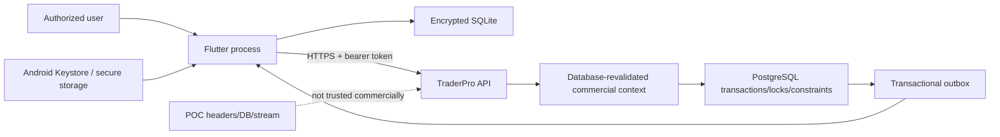

# TPSEC-001: Commercial Mobile Receiving Threat Model

- Status: Accepted Task 7C0 threat model; controls require implementation and verification in Tasks 7C1/7C2
- Date: 2026-08-01
- Scope: Commercial Receiving mobile identity, offline storage, synchronization,
  ownership, event/master cursors, and read-only monitoring

## Status

Accepted as the Task 7C0 threat baseline. Mitigations are requirements for
future implementation, not claims that production controls already exist.

## Security objective

Protect customer-owned Receiving facts and credentials while preserving
offline-captured physical evidence. Prevent unauthorized tenant/device access,
silent ownership takeover, payload mutation/replay, cursor leakage, plaintext
at-rest exposure, and partial cloud/local commits. Fail closed without deleting
or rewriting immutable evidence.

## Scope

- Task 7A access/refresh/Device-secret use by the Flutter client.
- Encrypted commercial SQLite and OS-backed secret/key storage.
- Start/Entry/Submit operation outbox and response-loss replay.
- Ownership generation, lease renewal/reacquisition, and transfer.
- `CommercialMobileSync` Receiving events and commercial master-sync cursor.
- Owner read-only projections and safe diagnostics.

## Non-goals and trust limits

This model does not claim protection against a fully compromised/rooted OS with
live instrumentation, a malicious authorized user entering false physical data,
hardware-scale authenticity, or unavailable TPCL-101/TPFS-101 business rules.
Hardware attestation, MFA, remote wipe, production key-rotation operations,
mobile integrity APIs, and PostgreSQL RLS implementation are deferred. RLS is
still a mandatory pre-production gate under ADR-0001.

ADR-0011 accepts SQLite3MultipleCiphers 2.3.6 for V1. The tested artifact does
not expose effective enhanced memory wiping/locking equivalent to SQLCipher's
verified memory-security control. Database encryption protects data at rest;
it does not protect plaintext or keys from a rooted device, an attached
debugger or instrumentation, arbitrary memory inspection, or another
compromised live process. Task 7C2B2 must use the shortest practical raw-key
lifetime in Dart memory, avoid string/log serialization, best-effort wipe
mutable key buffers, exclude keys from exception messages and database
payloads from diagnostics, use `temp_store=MEMORY`, configure Android backup
and data-extraction exclusions, and enforce a non-debuggable release posture.

## Authoritative sources

- `AGENTS.md`
- ADR-0001, ADR-0002, ADR-0004, ADR-0005, ADR-0008, ADR-0009, and ADR-0011
- TPTECH-001.13 through TPTECH-001.21
- TPRC-101 baseline/open questions
- Task 7C0 binding direction

## Assets

| Asset | Sensitivity/integrity need |
| --- | --- |
| Device secret and refresh token | High confidentiality; compromise enables session attempts. |
| Access token | High confidentiality for its short lifetime. |
| Database encryption key/reference | High confidentiality and availability. |
| Raw/processed weight and Entry payload | High integrity; raw text must remain unchanged. |
| Session/Entry master snapshots | High integrity; historical meaning must not drift. |
| Ownership editor/generation/lease | High integrity and authorization significance. |
| Operation ID/payload/hash/sequence | High integrity and replay significance. |
| Commercial event/master cursors | Tenant/device binding and monotonicity. |
| Supplier safe snapshots | Customer data; event allowlist excludes protected contact/PII. |
| Cloud reference and exact totals | Operational integrity; not a Purchase Bill/posting number. |

## Trust boundaries

The mobile process is not an authority for Workspace, Company, Branch, User,
Device, role, master current state, server time, lease expiry, or cloud
acceptance. It is authoritative evidence for what it stored locally before
networking, subject to server validation.

## Threats and mitigations

| ID | Threat/attack | Required mitigation | Detection/failure behavior | Residual/deferred risk |
| --- | --- | --- | --- | --- |
| T-01 | Stolen access token | Short Task 7A expiry, signature/issuer/audience checks, HTTPS, zero skew, database revalidation of workspace/user/device/credential/family/company/branch/role on every commercial request. | Revocation/status/version mismatch returns 401 without tenant detail; safe correlation only. | Token may be used until expiry/revocation if all current state remains valid. |
| T-02 | Stolen refresh token | Store only in OS-backed secure storage; server stores hash only; rotate each use; serialize refresh; detect predecessor reuse and revoke family. | `REFRESH_TOKEN_REUSE_DETECTED`, one audit, family revocation, forced login. | Rooted live extraction; MFA deferred. |
| T-03 | Stolen Device secret | OS-backed secure storage, never SQLite/logs; login also needs valid workspace/user password; reactivation rotates secret/version and revokes families. | Database revalidation rejects old secret-version access; activation/reactivation audited. | Compromised password plus Device secret until response. Hardware attestation deferred. |
| T-04 | Copied encrypted database | ADR-0011 SQLite3MultipleCiphers ChaCha20-Poly1305 full database/page encryption; true random raw 256-bit key outside DB and protected by OS; backup/cross-device restore fails closed; WAL/journal verification. | Wrong/missing/malformed/unavailable key cannot open; retain ciphertext; never fall back plaintext or generate a replacement key. | Production opener and backup exclusions require Task 7C2B2 verification. |
| T-05 | Plaintext fallback or debug database accidentally used commercially | Separate production file/schema/opener; release guard requires encrypted executor; startup self-test; no POC migration. | Fail startup/open and block capture; explicit safe error/diagnostic without key. | Implementation assurance must be tested on supported Android builds. |
| T-06 | Old Device submits queued operations after ownership transfer | Operation binds authenticated Device and immutable ownership generation; transfer increments generation and invalidates lease under PostgreSQL lock. | `RECEIVING_OWNERSHIP_GENERATION_STALE`; retain local fact/attention. | Business reconciliation of old facts awaits approved recovery workflow. |
| T-07 | Different Device takes over after lease expiry | Durable editor is distinct from lease; only same Device/same generation reacquires; different Device requires the implemented explicit Owner-only audited transfer command. | `RECEIVING_OWNERSHIP_DEVICE_MISMATCH`; no generation/lease mutation unless the separately authorized transfer succeeds. | Mobile transfer UI and later escalation/reconciliation policy remain deferred. |
| T-08 | Operation replay duplicates or changes type/meaning | All Start/Record/Submit IDs claim `Procurement.CommercialReceiving.MobileSyncOperation`; canonical hash includes actual type/context/Device/Session/sequence/operation-appropriate generation/payload, but no mutable cloud version or lease. PostgreSQL lock/unique indexes and stored result enforce replay. | Identical replay returns `PreviouslyProcessed`; same UUID under another type or meaning returns `IDEMPOTENCY_PAYLOAD_CONFLICT` without execution. | Retention horizon for idempotency results requires operational review. |
| T-09 | Refresh failure causes regenerated business operation IDs | Refresh coordinator is independent of operation outbox; callers wait for one refresh; outbox identity is immutable. | Network recovery reuses same operation/payload; tests compare bytes/IDs after restart. | None if implemented as specified. |
| T-10 | Cross-company, cross-workspace, or cross-audience cursor reuse | Cursor has no authority; endpoint filters database-revalidated Workspace/Company/role/audience. Owner broadcasts require Owner role; TargetDevice rows require the authenticated active issued Device. Current generation authorizes mutations and future targeting, not historical suppression. Local cursor key includes source/workspace/company/device/contract version. | Isolated empty/not-found/401 behavior; `COMMERCIAL_MASTER_CURSOR_INVALID` for opaque master-cursor scope mismatch. | PostgreSQL RLS remains defense-in-depth gate. |
| T-11 | Temporary POC cursor sees commercial events | Separate `CommercialMobileSync` enum/audience/query/route; POC reader filters only `MobileSync`; production refuses spikes. | Contract/integration tests seed all three streams and prove mutual exclusion. | POC cleanup later. |
| T-12 | Commercial cursor exposes `Internal` events | Commercial reader allowlists only `CommercialMobileSync`; master sync reads deterministic safe `commercial_mobile_master_changes`, never raw Internal outbox/payload. | Stream/audience constraints, migration inspection, and negative tests. | Future event/master fields require review. |
| T-13 | Payload JSON or hash tampering | Verify lowercase SHA-256 over exact UTF-8 payload; require duplicated envelope/payload IDs to match; parse typed values; canonical server hash binds authenticated context/Device. | `COMMERCIAL_MOBILE_OPERATION_PAYLOAD_HASH_INVALID` or deterministic Rejected result; no mutation/idempotent success. | Compromised app can create a new false fact as the authorized editor; scale authenticity deferred. |
| T-14 | Floating-point/format manipulation changes weight | Decimal JSON strings, Task 3 exact scaled-integer reprocessing, `numeric(20,6)`, display-string equality, no `double`/SQLite `REAL`. | `RECEIVING_WEIGHT_PROCESSING_MISMATCH`; complete rollback. | Physical scale/input fraud out of scope. |
| T-15 | Stale or inactive master/settings silently reclassified | Payload carries master and Procurement Settings IDs/versions; server validates exact same-company status/version/relationships and snapshots that revision. Only configured destination/Weight Policy defaults are accepted until override approval. | `NeedsAttention` with stable inactive/stale/settings code; original payload retained; no new default or alternate substitution. | Authorized stale recovery and default-override choices unresolved. |
| T-16 | Mutable master join rewrites history | Persist safe Session/Entry snapshots and immutable triggers; submitted views use snapshots only. | Database/update tests and snapshot regression tests. | Future schema changes require migration review. |
| T-17 | Outbox/audit failure leaves aggregate committed | Aggregate, Entry/projection, audit, commercial event, and idempotent result share one transaction. | Injected failure rolls all writes back; retry can execute. | External publisher latency; committed cursor remains recovery source. |
| T-18 | Event cursor advances past malformed known event | Inbox insert, projection, apply state, and cursor share one encrypted SQLite transaction. | Roll back and stop at event; safe diagnostic. Unknown compatible type retained as skipped. | Long-lived poison-event operations/retention policy deferred. |
| T-19 | PII leaks through events/logs/diagnostics | Versioned event allowlist contains operational safe snapshots only; Supplier contact/email/address/tax/notes and all credentials/lease IDs are prohibited; central redaction. | Contract tests inspect exact payload/log fields; security review for new versions. | Product names/supplier names are still customer data protected by auth/encryption. |
| T-20 | Debug HTTP or cleartext release traffic | Task 7A production HTTPS enforcement; commercial client accepts HTTPS only outside explicit test harness; POC cleartext stays debug-only. | Release/static tests and startup failure; certificate/network errors do not downgrade. | Certificate pinning not required by current source; may be reviewed later. |
| T-21 | Rooted Device or live-process compromise reads runtime secrets or tampers with client | Minimize token and raw-key lifetime/in-memory exposure; never stringify/log keys; best-effort wipe mutable key buffers; exclude keys and payloads from diagnostics; use memory-only temp storage, OS-backed keys, database revalidation, server recomputation, non-debuggable release, generation, audit, and optional future integrity signal. | Revoke Device/family and investigate audit/attention anomalies; no diagnostic or recovery path emits key/database payload material. | SQLite3MultipleCiphers lacks the tested SQLCipher-equivalent memory locking/wiping control; root, debugger/instrumentation, or arbitrary live-memory access can defeat at-rest/runtime controls. Hardware attestation/integrity API deferred. |
| T-22 | Local clock extends lease or reorders facts | Server clock controls lease and accepted timestamps; exact local sequence controls order; captured Device time is evidence only. | Expired lease/reacquisition response; invalid UTC rejected locally/server-side. | User may falsify capture time; policy for extreme skew may be added without making it authority. |
| T-23 | Database key loss causes silent data destruction | No auto-delete or plaintext recreation; preserve ciphertext; show blocking recovery/discard flow; warn about unsynced facts. | `COMMERCIAL_DATABASE_KEY_UNAVAILABLE`; capture/sync blocked. | Without recoverable key/backup, unsynced physical facts may be unrecoverable. Remote escrow not approved. |
| T-24 | Backup restores credentials/database to another Device | Exclude secrets; bind encrypted DB/profile/outbox to Workspace/Company/Device; Keystore keys non-exportable/non-restorable where supported; revalidate `/auth/me`. | Cross-Device/context mismatch fails closed and requires reactivation/rehydration. | OEM backup behavior must be verified in Task 7C2. |
| T-25 | Ownership/submission race leaves submitted Session leased | One PostgreSQL lock order and state-shape constraints cover Session/ownership. Submission clears lease atomically; transfer reloads state/generation. | Losing operation returns status/generation conflict; impossible state rejected by DB. | None after migration/integration tests. |
| T-26 | Batch error blocks unrelated field work | Per-operation transactions and aggregate-specific blocking; global body errors only for unreadable request structure. | Earlier commits retained; unrelated aggregate continues; safe per-op result. | Large-batch abuse mitigated by maximum 50/rate limits. |
| T-27 | Unauthorized Owner monitoring mutates Entry | Owner list/live routes are reads; local projection has no capture/Submit port; commercial role is database-revalidated. Owner transfer is a separate implemented audited backend command and its Task 7C2 UI is deferred. | Authorization denies; query/cursor reads mutate no server state. | Settlement controls and mobile transfer UI remain deferred. |
| T-28 | Same-company Operator reads another Device's Session events | Operators receive only immutable `TargetDevice` rows issued to their authenticated active Device; they never inherit Owner broadcasts. A former editor can receive transfer-away history, while later events target the new editor. Session list/live and all mutations still revalidate current ownership. | Negative tests prove the old Device receives transfer-away, no future Entry/Submit rows target it, and unrelated Device event IDs/payloads remain absent. | Broader non-editor Operator discovery awaits OQ-12. |
| T-29 | Master bootstrap races a mutation and skips or duplicates a record | Migration deterministically backfills all existing Active/Inactive 7B1/7B2 rows; high-water capture and mutation sequence allocation share the scoped master-stream lock; bootstrap pages unique sequences through `H`, then deltas use `> H`; client upsert/cursor apply is atomic. | Upgrade/concurrency tests start with existing commercial data and prove every safe kind/ID/version exactly once in traversal, later change after `H`, and no raw Internal field. | Change-log retention/compaction needs later operational policy. |
| T-30 | One global event commit lock creates cross-company contention or incorrect cursor assumptions | Derive the `CommercialMobileSync` commit-order lock from stream contract version + Workspace + Company; same-company allocation holds it through commit and different companies proceed independently. | Concurrency tests prove same-company commit order, cross-company overlap, and valid sequence gaps. | Database-wide sequence exhaustion/retention remains an operational concern. |

## Abuse cases and security invariants

1. Possessing a Session ID, cursor, operation ID, payload, or copied database
   is never sufficient authority.
2. A bearer token cannot override current database workspace/company/branch/
   user/device/role/family state.
3. A lease is usable only by the durable authenticated editor at the same
   ownership generation.
4. Transfer cannot rewrite an Entry or operation payload.
5. A response-loss retry cannot create a second Entry, increment count/total
   twice, or assign a second reference.
6. No event/cursor response contains Device secret, access/refresh token,
   database key, lease ID, Supplier protected fields, or Internal payload.
7. No local error path silently opens, copies, or recreates customer data in
   plaintext.
8. Ordered mobile operations never use a mutable expected cloud version as
   immutable payload, hash input, or concurrency authority.

## Data ownership

Cloud PostgreSQL is authoritative for accepted shared state, ownership, and
commercial context. The authenticated editor's encrypted database owns
locally captured physical evidence and durable outbound intent. Secure storage
owns secret/key material. Owner mobile projections and master caches are copies
and cannot mutate their cloud sources.

## Transaction boundaries

Security-relevant atomic units are: Task 7A refresh rotation; Start; Entry;
Submit; ownership change; local capture; operation-response apply; event apply;
master-page apply; and encryption-key switch. Their detailed members are
defined in TPTECH-001.21. No external message is sent inside a command
transaction; transactional outbox state commits with the command.

## Failure behavior

Fail closed on authentication/context mismatch, missing/wrong database key,
invalid hash, stale generation, wrong Device, cross-company cursor, malformed
known event, and insecure transport. Preserve local ciphertext and immutable
facts. Report stable safe codes without tokens, keys, raw SQL, stack traces, or
cross-tenant existence.

## Security implications

The highest pre-pilot blockers are encrypted SQLite verification, secure token/
key storage, authenticated commercial operation/event/master routes, release
HTTPS enforcement, production ownership generation tests, safe event payload
review, and PostgreSQL RLS. A field test does not waive these blockers.

## Migration implications

Task 7C1 migration must add production ownership/generation/state constraints,
new commercial event audience metadata, and no-delete/immutable triggers.
Task 7C2B2 must start a separate SQLite3MultipleCiphers encrypted schema,
disable plaintext fallback and backup leakage, enforce ADR-0011 configuration
assertions, and test wrong-key/reinstall/restore. Existing POC schema/data
remains unchanged.

## Future implementation dependencies

- Task 7C1 and Task 7C2 backlogs
- Encrypted SQLite and OS secure-storage compatibility spike
- RLS design/implementation before production
- Operational incident response for Device/family revocation
- Product decisions for transfer and fact recovery

## Unresolved questions

- Later transfer escalation/consent policy and mobile transfer UI
- Lease grace and anomaly thresholds beyond the implemented duration
- Key recovery/escrow policy, if any
- Supported Android versions/OEM backup behavior
- Idempotency/event/master-change retention and archival windows
- Extreme capture-time skew policy

## Deferred controls

The following remain explicitly deferred and must not be claimed implemented:

- hardware attestation;
- PostgreSQL RLS implementation;
- MFA;
- remote wipe;
- production key-rotation operations;
- Android/Play mobile integrity APIs.
